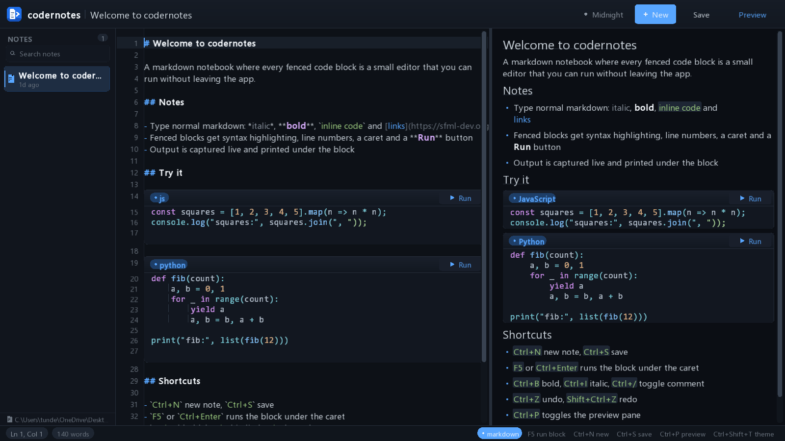
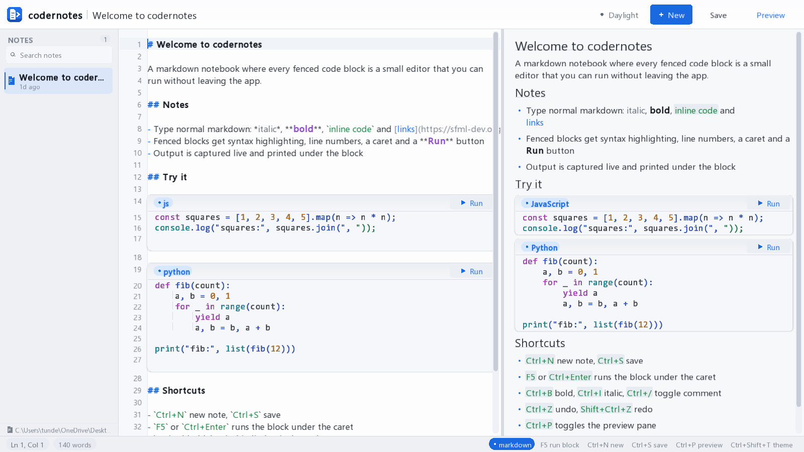

# codernotes

A markdown notebook where every fenced code block is a small editor you can run
without leaving the app. Native desktop, built with C++17, [SFML 3](https://www.sfml-dev.org/)
and [xmake](https://xmake.io). No web view, no runtime, no telemetry — a single
self-contained executable.



## What it does

- **Markdown editor and live preview** side by side, with a draggable splitter
- **Runnable code blocks** — each fence becomes its own editor with syntax
  highlighting, line numbers, a caret and a `Run` button. Output streams back
  underneath the block with a status pill showing exit code and duration
- **Runs 19 languages** when the toolchain is on your `PATH`: JavaScript,
  TypeScript, Python, C, C++, Java, Go, Rust, Ruby, shell, Lua, PowerShell, PHP,
  Swift, Kotlin, Zig, Dart, R and SQL
- **Plain `.md` files** on disk, autosaved. No database, no proprietary format —
  your notes stay readable without this app
- **Four themes** (Midnight, Graphite, Nord, Daylight) cycled with
  `Ctrl+Shift+T`; the choice persists between launches
- **Search** the note list as you type, undo/redo, clipboard, per-monitor DPI
  awareness, and a custom-drawn app icon



## Building

Requires [xmake](https://xmake.io) and a C++17 compiler. SFML is fetched
automatically by xmake.

```sh
xmake f -m release
xmake
```

The binary lands in `build/<platform>/<arch>/<mode>/codernotes`. It links SFML
statically, so nothing else needs to be installed alongside it.

## Keyboard shortcuts

| Shortcut | Action |
| --- | --- |
| `Ctrl+N` | New note |
| `Ctrl+S` | Save now (changes also autosave) |
| `Ctrl+P` | Toggle the preview pane |
| `Ctrl+Shift+T` | Cycle colour theme |
| `F5` / `Ctrl+Enter` | Run the block under the caret |
| `Ctrl+B` / `Ctrl+I` | Bold / italic |
| `Ctrl+/` | Toggle comment |
| `Ctrl+Z` / `Ctrl+Shift+Z` | Undo / redo |
| `Escape` | Clear selection, or leave the search field |

## Diagnostics

The binary carries a few flags that are useful during development:

| Flag | Purpose |
| --- | --- |
| `--selftest` | Run 32 layout, input, persistence and theme assertions |
| `--selftest-live` | Same, against a real visible window |
| `--screenshot <file>` | Render offscreen to a PNG (`--size W H` to set the size) |
| `--benchmark <n>` / `--profile <n>` | Frame timing |
| `--test-run <lang>` | Smoke-test a single runner, e.g. `--test-run python` |
| `--icon <file>` | Write a contact sheet of the app icon at every OS size |

## How it is put together

Everything is drawn by hand — there is no widget toolkit. `src/draw.cpp` is a
small immediate-mode layer with a glyph batch (one draw call per font page) and
scissored clipping, which is what keeps a full redraw cheap: roughly 3 ms per
frame at 1600x900.

| Area | Files |
| --- | --- |
| Shell, chrome, CLI, self-tests | `main.cpp` |
| Block editor, run buttons, output | `editor_view.*` |
| Rendered markdown | `preview_view.*`, `richtext.*` |
| Text model, undo/redo, selection | `doc.*` |
| Markdown parsing, syntax highlighting | `markdown.*`, `highlight.*` |
| Process execution and output capture | `runner.*` |
| Note discovery and persistence | `note.*` |
| Palettes, metrics, font loading | `theme.*` |
| Window icon and header mark | `brand.*` |

## Known limitations

- **Fonts are not bundled.** The app uses system fonts (Segoe UI / DejaVu Sans
  and Consolas / DejaVu Sans Mono, with fallbacks). If none of the candidates
  exist it exits with an error. Metrics therefore differ slightly per machine.
  Dropping `ui.ttf` and `mono.ttf` into `assets/fonts/` overrides this.
- **Windows and Linux are exercised; macOS is not.** All three build in CI and
  the self-test passes on Windows and Linux. The macOS binary has never been
  run — GitHub's macOS runners have no window server, so its self-test is
  skipped there. Treat Apple Silicon as untested.
- **No IME support.** SFML reports composed text via `TextEntered` but offers no
  input-method composition, so CJK and other IME input will not compose.
- **Notes are stored next to the working directory** (`notes/`), not under
  `%APPDATA%`. Fine for a portable build; awkward if you install into a
  read-only location such as `Program Files`.
- **Keyboard navigation is incomplete.** The note list is not reachable with the
  arrow keys and there is no tab order between panes.

## License

MIT — see [LICENSE](LICENSE).

SFML is licensed under the zlib/libpng license. The bundled binary links it
statically.
